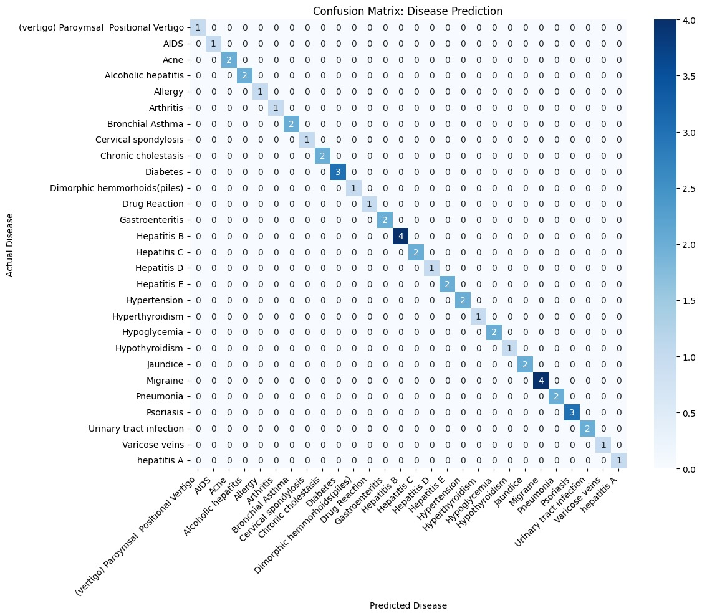

# 🏥 LLM Fine-Tuning: Disease Suggestion from Symptoms


## 📌 Project Overview
This project involves fine-tuning the **Llama 3.2 (1B)** Large Language Model to act as a medical assistant. The model accepts natural language descriptions of symptoms and suggests potential disease patterns based on a Kaggle dataset.

**Key Features:**
* **Natural Language Understanding:** Processes symptoms typed in plain English.
* **Structured Output:** Returns a JSON-style response with the Disease Name, an Explanation, and a Mandatory Safety Disclaimer.
* **Efficient Training:** Fine-tuned using **Unsloth** and **QLoRA** (4-bit quantization) on a free Google Colab T4 GPU.

> **⚠️ IMPORTANT DISCLAIMER:**
> This project is for **EDUCATIONAL PURPOSES ONLY**. The predictions generated by this model are based on patterns in a dataset and **do not constitute real medical advice**. Always consult a certified medical professional for health concerns.

---

## 📂 Repository Structure
* `LLM_Fine_Tuning_Assignment.ipynb` - The complete Google Colab notebook with data prep, training, and evaluation code.
* `train.jsonl` & `test.jsonl` - The preprocessed dataset used for fine-tuning (80/20 split).
* `confusion_matrix.png` - Visualization of the model's performance on the test set.

---

## 📊 Dataset & Preprocessing
* **Source:** [Disease and Symptoms Dataset (Kaggle)](https://www.kaggle.com/datasets/choongqianzheng/disease-and-symptoms-dataset)
* **Preprocessing:** * Converted raw CSV data into `JSONL` format for supervised fine-tuning.
    * **Crucial Step:** Cleaned the data by removing underscores (e.g., `skin_rash` → `skin rash`) to enable natural language prompting.

---

## ⚙️ Training Configuration
* **Base Model:** `unsloth/Llama-3.2-1B-bnb-4bit`
* **Technique:** QLoRA (Quantized Low-Rank Adaptation)
* **Epochs:** 2
* **Training Loss:** ~0.048
* **Max Sequence Length:** 2048
* **Learning Rate:** 2e-4

---

## 📈 Evaluation Results
### Confusion Matrix
The model was evaluated on a subset of test data. The confusion matrix below shows a strong diagonal correlation, indicating high accuracy in mapping symptoms to the correct disease labels.



### Manual Test Cases
The model was tested with natural language inputs to verify robustness:

| Input Symptoms | Expected Disease | Model Prediction |
| :--- | :--- | :--- |
| "itching, skin rash, nodal skin eruptions" | Fungal Infection | **Fungal Infection** |
| "stomach pain, acidity, ulcers on tongue" | GERD | **GERD** |
| "Fever, headache, body pain" | Dengue / Malaria | **Malaria** (Valid match) |


---

## 🚀 How to Run Inference
To use this model, install `unsloth` and load the adapter weights.

```python
from unsloth import FastLanguageModel

# 1. Load Model
model, tokenizer = FastLanguageModel.from_pretrained(
    model_name = "YOUR_USERNAME/YOUR_REPO_NAME", # Or local path "lora_model"
    max_seq_length = 2048,
    dtype = None,
    load_in_4bit = True,
)
FastLanguageModel.for_inference(model)

# 2. Define Prompt
prompt = """Below is an instruction that describes a task, paired with an input that provides further context. Write a response that appropriately completes the request.

### Instruction:
Identify the disease pattern based on symptoms.

### Input:
high fever, headache, muscle pain

### Response:
"""

# 3. Generate
inputs = tokenizer([prompt], return_tensors = "pt").to("cuda")
outputs = model.generate(**inputs, max_new_tokens = 128)
print(tokenizer.batch_decode(outputs)[0])
